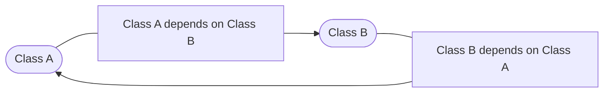

# Chapter 01 A Primer on Python and the Development Environment
## Version control with Git tracking
### Making development easy with IDEs
As Python programmers, you most likely have a preference in terms of local development environments. However, to avoid the risk of instilling any redundancies, we will walk you through our preferred local development landscape in case you want to mimic the same workflow we’ll follow for this tutorial.

#### iTerm2
We pride ourselves on being superfans of strategic laziness, where we set up programming landscapes that are not only easy on the eyes but also take little to nothing to maintain. As Mac programmers, the Terminal interface can be quite dull; that’s why we recommend installing iTerm2, which works well on Macs that run macOS 10.14 or newer. As stated on their website, `“iTerm2 brings the Terminal into the modern age with features you never knew you always wanted.”` Take some time to install and customize your new iTerm2 Terminal so that it’s aesthetically pleasing; it’s much easier to fall into the creativity of development design when your eyes are intrigued by your Terminal.

You can follow the instructions mentioned here to download and set up iTerm2: https://iterm2.com/downloads.html.

#### PyCharm
Next, we recommend using your newly remodeled Terminal to download our favorite IDE: PyCharm. For those of you unfamiliar with IDEs, you can think of an IDE in a similar fashion to iTerm: a visual interface that not only creates an aesthetically pleasing coding environment but also allows you to quickly, efficiently format and structure files with a few short commands. Our local PyCharm environment will be where we choose to clone the Git repository that we created in the previous section.

You can follow the instructions mentioned here to download and set up PyCharm: https://www.jetbrains.com/pycharm/download/#section=mac.

You will also need to register your GitHub account to your new PyCharm app by following these steps: https://www.jetbrains.com/help/pycharm/github.html.

#### Jupyter Notebook
Lastly, since we will be working with data, visualizing sections of DataFrames can be quite difficult in a standard Python script without a bit of finagling. Staying with the theme of strategic laziness, we recommend downloading the beautiful and user-friendly Jupyter Notebook for easy data visualization. As a word of warning, Jupyter Notebooks is an amazing tool for development, but we stress that it is not recommended that you deploy Jupyter scripts in a production environment. Jupyter’s friendly UI interface and easy visualization of code are due to its memory- and processing-heavy framework that is inevitably quite clunky and slow in a pipeline.

You can follow the instructions mentioned here to download and set up Jupyter Notebook: https://jupyter.org/install.

Next, we will document the environmental dependencies using a requirements.txt file.
## Documenting environment dependencies with requirements.txt
Creating and maintaining a requirements.txt document is a standard practice in Python application development. Future updates or major changes to dependencies could potentially break the application, but developers can always install the recorded previous versions, ensuring smooth execution of the code without errors. By freezing the application to specific versions of dependencies, it ensures that, given the correct requirements, your project will maintain its original state. This approach proves beneficial, providing a win-win situation for developers and the application’s reliability.

Let’s look at how to install dependencies using the requirements.txt file:
```bash
(base) usr@project%   pip install -r requirements.txt
pip==3.9
python==3.9.4
pandas==1.4.2
requests==2.28.0
```
Additionally, you can update and store the new package imports and versions with the following command to keep the requirements.txt file up to date:
```bash
(base) usr@project %   pip freeze >> requirements.txt
```
That is how we can collect dependencies in the requirements.txt file. The next section will review some key concepts that are essential to know before we start building data pipelines.

### Accounting for circular dependencies
The concept of circular dependency is not always talked about when first learning Python, but it’s a concept where one or more modules depend on each other:


Figure 1.1: A circular dependency

While there are many useful aspects of this interdependency, underlying second and third-degree inconsistencies, such as one Python module version being incompatible with another Python module version, can result in a cascading effect of uncontrolled errors that lead to a smorgasbord of application failures. Alluding back to our initial analogy about a development project being similar to a laboratory experiment, this is why system sterility comes into play. To create an internally consistent environment, versions of the dependencies must be flexibly adjusted to account for the circular interdependencies of imports. This magic of MMS begins!

## Utilizing module management systems (MMSs)
MMSs are like special folders that only work in certain environments. They do this by changing sys.prefix and sys.exec_prefix so that they point to the base directory of the virtual environment. This is helpful because it lets developers create “clean” applications and also makes sure that all the different parts of the project work well together.

There are many different module management systems to choose from, but Anaconda is the most popular. However, it doesn’t always have the most up-to-date packages for data engineers, and pip, the regular package manager for Python, doesn’t work well with Anaconda. That’s why we’re using pipenv in this book. It’s a virtual environment and package management system that uses Pipfile and Pipfile.lock, similar to a requirements.txt file.

### Instigating a virtual MMS environment within your local IDE
Creating a virtual MMS environment within your local IDE can be a helpful way to test and run your code before you implement it in a larger system. This virtual environment allows you to simulate different scenarios and conditions to ensure that your code is working properly and efficiently. It can also help you identify and fix any errors or bugs that may arise during the development process.

Overall, setting up a virtual MMS environment within your local IDE can be a valuable tool for streamlining your coding workflow and ensuring that your projects are successful.

## Configuring a Pipenv environment in PyCharm
In Python development, managing project environments is crucial to keep your project’s dependencies organized and controlled. One way to achieve this is by using pipenv. Let’s start the process by [installing Pipenv](https://pipenv.pypa.io/en/latest/#install-pipenv-today). Open your Terminal and execute the following command:
```bash
(base) usr@project %   pip install --user pipenv
```

This command instructs pip (a Python package manager) to install Pipenv in your user space. The --user option ensures that Pipenv is installed in the user install directory for your platform.

After successful installation, this is what your Terminal should look like:
```bash
Collecting pipenv
  Downloading pipenv-2023.12.1-py3-none-any.whl (3.1 MB)
     |████████████████████████████████| 3.1 MB 3.9 MB/s 
Requirement already satisfied: setuptools>=67 in /usr/local/lib/python3.9/dist-packages (from pipenv) (69.1.1)
Requirement already satisfied: virtualenv>=20.24.2 in /usr/local/lib/python3.9/dist-packages (from pipenv) (20.25.1)
Requirement already satisfied: certifi in /usr/local/lib/python3.9/dist-packages (from pipenv) (2024.2.2)
Requirement already satisfied: filelock<4,>=3.12.2 in /usr/local/lib/python3.9/dist-packages (from virtualenv>=20.24.2->pipenv) (3.13.1)
Requirement already satisfied: platformdirs<5,>=3.9.1 in /usr/local/lib/python3.9/dist-packages (from virtualenv>=20.24.2->pipenv) (4.2.0)
Requirement already satisfied: distlib<1,>=0.3.7 in /usr/local/lib/python3.9/dist-packages (from virtualenv>=20.24.2->pipenv) (0.3.8)
Installing collected packages: pipenv
Successfully installed pipenv-2023.12.1
```
Once installed, remember to activate the pipenv environment before you begin to work on your new project. This way, the entirety of your project is developed within the isolated virtual environment.

Each time you activate pipenv, the command line will display the following:
```bash
robert0714@cloudshell:~$ pipenv shell

Creating a virtualenv for this project...
Pipfile: /home/robert0714/Pipfile
Using default python from /usr/bin/python3 (3.9.2) to create virtualenv...
⠹ Creating virtual environment...created virtual environment CPython3.9.2.final.0-64 in 640ms
  creator CPython3Posix(dest=/home/robert0714/.local/share/virtualenvs/robert0714-ml-Qejtm, clear=False, no_vcs_ignore=False, global=False)
  seeder FromAppData(download=False, pip=bundle, setuptools=bundle, wheel=bundle, via=copy, app_data_dir=/home/robert0714/.local/share/virtualenv)
    added seed packages: pip==24.0, setuptools==69.1.0, wheel==0.42.0
  activators BashActivator,CShellActivator,FishActivator,NushellActivator,PowerShellActivator,PythonActivator

✔ Successfully created virtual environment!
Virtualenv location: /home/robert0714/.local/share/virtualenvs/robert0714-ml-Qejtm
Creating a Pipfile for this project...
Launching subshell in virtual environment...
 . /home/robert0714/.local/share/virtualenvs/robert0714-ml-Qejtm/bin/activate
robert0714@cloudshell:~$  . /home/robert0714/.local/share/virtualenvs/robert0714-ml-Qejtm/bin/activate
```
Now that we have learned how to activate a virtual environment using pip, we can move on to installing packages within that environment.

### Installing packages
pip- packages can be added or removed from the environment via simple ``$ pipenv install`` or `$ pipenv uninstall commands` since activating the pipenv environment is designed to replace the need for the pip- tag in the command line.

### Pipfile and Pipfile.lock
When a pipenv environment is initiated, an empty Pipfile is automatically created. As mentioned previously, Pipfile is synonymous with the requirements.txt file.

Pipfile.lock is created to specify which version of the dependencies referenced in Pipfile should be used to avoid automatic upgrades of packages that depend on each other. You can run the $ pipenv lock command to update the Pipfile.lock file with the currently used versions of all the dependencies within your virtual environment. However, pipenv takes care of updating the Pipfile and Pipfile.lock files with each package installation.

The following example shows how we can use Pipfile and Pipfile.lock:
```bash
(robert0714) robert0714@cloudshell:~$ pipenv install numba
Installing numba...
Resolving numba...
Added numba to Pipfile's [packages] ...
✔ Installation Succeeded
Pipfile.lock not found, creating...
Locking [packages] dependencies...
Building requirements...
Resolving dependencies...
✔ Success!
Locking [dev-packages] dependencies...
Updated Pipfile.lock (af719a270df08e2e359c617a22e3cbbd1e110ac8c0d2570abcca1757713cb424)!
Installing dependencies from Pipfile.lock (3cb424)...
(robert0714) robert0714@cloudshell:~$ 
```
Now, let’s summarize what we have learned in this chapter in the next section.

